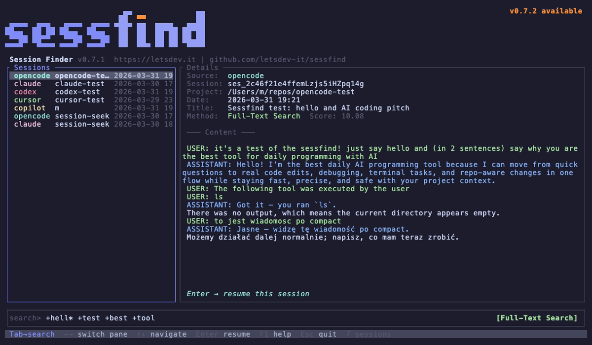

# sessfind

**CLI tool to search and resume AI sessions across GitHub Copilot, Claude Code, and OpenCode.**

*GitHub Copilot · Claude Code · OpenCode*

[letsdev.it](https://letsdev.it)



---

## What is sessfind?

`sessfind` indexes and searches your AI assistant sessions from **GitHub Copilot**, **Claude Code**, and **OpenCode** in one place, and lets you **resume** a session from the UI or CLI. Ever had a conversation about a topic days ago and could not find it? `sessfind` is for that.

**Features:**

- Full-text search (BM25 ranking via tantivy) across all your sessions
- Interactive TUI with split-pane layout, real-time filtering, and session preview
- Fuzzy substring matching as alternative search mode
- **Semantic search** — find conceptually similar sessions using ML embeddings (optional plugin)
- Resume any session directly from the search results
- Incremental indexing — only processes new/changed sessions
- Zero external runtime dependencies — single static binary

## Supported Sources

| Source | Session Location | Resume Command |
|--------|-----------------|----------------|
| **GitHub Copilot** | `~/.copilot/session-state/*/events.jsonl` | `copilot --resume=SESSION_ID` |
| **Claude Code** | `~/.claude/projects/*/` | `claude --resume SESSION_ID` |
| **OpenCode** | `~/.local/share/opencode/opencode.db` | `opencode --session SESSION_ID` |

## Installation

### From crates.io

```bash
cargo install sessfind
```

Requires Rust **1.85+** (edition 2024).

### From GitHub Releases

Each [release](https://github.com/letsdev-it/sessfind/releases) includes prebuilt archives (Linux x86_64 / aarch64, macOS Intel / Apple Silicon) and SHA256 checksums. Download the `tar.gz` for your platform, unpack, and put `sessfind` on your `PATH`.

### From source

```bash
git clone https://github.com/letsdev-it/sessfind.git
cd sessfind
cargo install --path crates/sessfind
```

### Build manually

```bash
cargo build --release
# Binaries at target/release/sessfind and target/release/sessfind-semantic
cp target/release/sessfind ~/.local/bin/
```

### Semantic search plugin (optional)

The semantic search plugin uses an embedded ML model (~450MB) to find sessions by meaning, not just keywords. It supports **Polish and English** (and 100+ other languages).

```bash
# From crates.io
cargo install sessfind-semantic

# Or from source
cargo install --path crates/sessfind-semantic
```

Once installed, `sessfind` automatically detects the plugin and enables semantic search mode in the TUI (`Shift+Tab` to cycle) and CLI (`--method semantic`).

## Quick Start

```bash
# 1. Index your sessions (first time, or after new sessions)
sessfind index

# 2. Launch the interactive TUI
sessfind
```

That's it. Start typing to search. You can also combine both steps: `sessfind --index`.

## Usage

### Interactive TUI (default)

```bash
sessfind            # launch TUI
sessfind --index    # index all sources first, then launch TUI
```

Opens a full-screen terminal UI with:

- **Left pane** — search results list (source, project, date)
- **Right pane** — session details and conversation preview
- **Bottom** — search input with mode indicator

#### Keybindings

| Key | Action |
|-----|--------|
| *Type* | Filter sessions in real-time |
| `Tab` | Switch focus between search and results |
| `Shift+Tab` | Toggle search mode (FTS / Fuzzy / Semantic) |
| `Up/Down`, `j/k` | Navigate results |
| `Enter` | Resume selected session (or trigger Semantic search) |
| `PgUp/PgDn` | Scroll session preview |
| `Ctrl+U` | Clear search input |
| `?` | Show help popup |
| `Esc` | Quit |

#### Search Modes

**FTS (Full-Text Search)** — default, powered by tantivy BM25:

```
kalkulator              single keyword
kalkulator b2b          any of these words (OR)
+kalkulator +b2b        all words required (AND)
"kalkulator b2b"        exact phrase
kalkulat*               prefix wildcard
```

**Fuzzy** — case-insensitive substring match across content, project name, and title.

**Semantic** — ML embedding similarity search (requires `sessfind-semantic` plugin). Finds conceptually similar sessions even when exact keywords don't match. Supports Polish and English. Press `Enter` to trigger search (not instant — runs the ML model).

### CLI Commands

```bash
# Index sessions
sessfind index                     # index all sources
sessfind index --source claude     # index only Claude Code
sessfind index --force             # re-index everything

# Search from CLI (non-interactive)
sessfind search "kalkulator b2b"
sessfind search "react hook" --source claude --limit 20
sessfind search "auth" --after 2025-01-01 --before 2025-03-01
sessfind search "deploy" -p my-project

# Semantic search (requires sessfind-semantic plugin)
sessfind search "how to handle authentication" --method semantic

# Show full session content
sessfind show SESSION_ID

# Index statistics (includes semantic plugin status)
sessfind stats

# Dump all chunks as JSONL (used by plugins)
sessfind dump-chunks
```

### CLI Search Flags

| Flag | Description |
|------|-------------|
| `-s, --source` | Filter by source (`claude`, `opencode`, `copilot`) |
| `-p, --project` | Filter by project name (substring match) |
| `--after` | Only results after date (`YYYY-MM-DD`) |
| `--before` | Only results before date (`YYYY-MM-DD`) |
| `-n, --limit` | Max results (default: 10) |
| `-m, --method` | Search method: `fts` (default), `fuzzy`, `semantic` |

## How It Works

1. **Indexing** — sessfind reads session files from each source, pairs user/assistant messages into chunks (~6000 chars), and indexes them with tantivy full-text search.

2. **Incremental updates** — file mtime/size is tracked in SQLite, so only new or modified sessions are re-indexed on subsequent runs.

3. **Search** — FTS mode queries the tantivy index with BM25 ranking. Fuzzy mode does in-memory substring matching on pre-loaded chunks.

4. **Semantic search** — the optional `sessfind-semantic` plugin generates vector embeddings (multilingual-e5-small model, 384 dimensions) for each chunk and stores them in a local sqlite-vec database. Queries are embedded and compared via cosine similarity.

5. **Resume** — selecting a session and pressing Enter replaces the current process (`exec()`) with the appropriate tool's resume command.

### Data Storage

```
~/.local/share/sessfind/
├── index/          # tantivy search index
├── state.db        # SQLite tracking indexed sessions
└── semantic.db     # sqlite-vec embeddings (if plugin installed)
```

### Project Structure

```
crates/
├── sessfind/           # main binary (TUI, CLI, indexer, sources)
├── sessfind-common/    # shared types (Source, SearchResult, SearchParams)
└── sessfind-semantic/  # optional plugin (embedder, sqlite-vec store)
```

## Dependencies

### sessfind (main binary)

| Crate | Purpose |
|-------|---------|
| [tantivy](https://github.com/quickwit-oss/tantivy) | Full-text search engine |
| [ratatui](https://github.com/ratatui/ratatui) | Terminal UI framework |
| [crossterm](https://github.com/crossterm-rs/crossterm) | Cross-platform terminal |
| [clap](https://github.com/clap-rs/clap) | CLI argument parsing |
| [rusqlite](https://github.com/rusqlite/rusqlite) | SQLite (index state + OpenCode) |
| [serde](https://github.com/serde-rs/serde) / serde_json / serde_yaml | Serialization |
| [chrono](https://github.com/chronotope/chrono) | Date/time handling |
| [walkdir](https://github.com/BurntSushi/walkdir) | Directory traversal |
| [rayon](https://github.com/rayon-rs/rayon) | Parallel processing |
| [which](https://github.com/harryfei/which-rs) | Plugin detection |

### sessfind-semantic (optional plugin)

| Crate | Purpose |
|-------|---------|
| [fastembed](https://github.com/Anush008/fastembed-rs) | ML embeddings (multilingual-e5-small via ONNX Runtime) |
| [sqlite-vec](https://github.com/asg017/sqlite-vec) | Vector search in SQLite |
| [rusqlite](https://github.com/rusqlite/rusqlite) | SQLite database |

## Contributing

Contributions are welcome! Please open an issue or submit a pull request.

```bash
# Dev build (faster iteration)
cargo build

# Run main binary
cargo run -p sessfind

# Run with args
cargo run -p sessfind -- search "query"
cargo run -p sessfind -- index --force

# Run semantic plugin
cargo run -p sessfind-semantic -- index
cargo run -p sessfind-semantic -- search "query"
```

## License

[MIT](LICENSE) © [Let's Dev .IT](https://letsdev.it)
