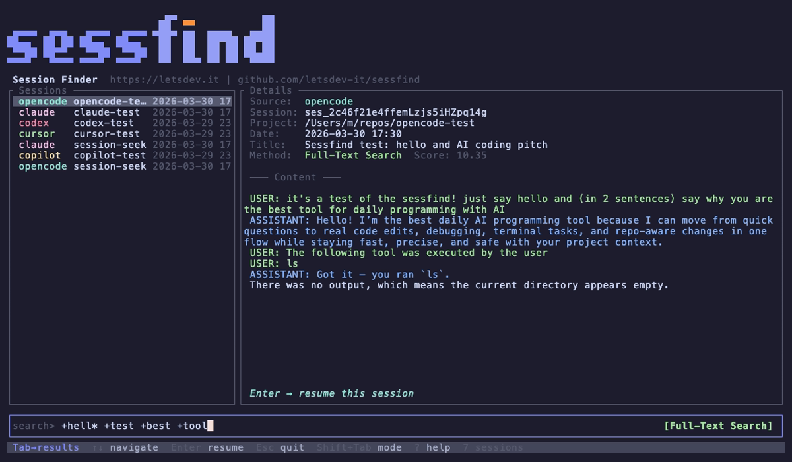
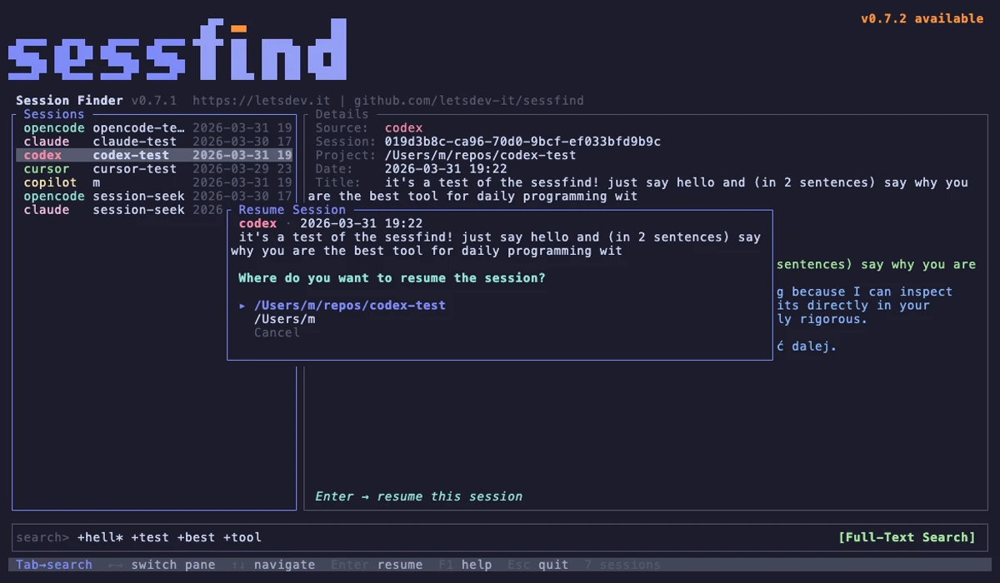

# Interactive TUI

## Launching the TUI

```bash
sessfind            # launch TUI
sessfind --index    # index all sources first, then launch TUI
```

## Pane Layout

The TUI opens in full-screen mode with three areas:

- **Left pane** — search results list (source, project, date)
- **Right pane** — session details and conversation preview
- **Bottom** — search input with mode indicator



## Keybindings

| Key | Action |
|-----|--------|
| *Type* | Filter sessions in real-time |
| `Tab` | Switch focus between search and results |
| `Shift+Tab` | Toggle search mode (FTS / Fuzzy / LLM / Semantic*) |
| `Ctrl+S` | Toggle sort order (Newest first / Best match) |
| `Up/Down`, `j/k` | Navigate results |
| `Enter` | Resume selected session (opens confirmation dialog) |
| `PgUp/PgDn` | Scroll session preview |
| `Ctrl+U` | Clear search input |
| `?` | Show help popup |
| `Esc` | Quit |

!!! note
    `Semantic` mode is only available when the [`sessfind-semantic`](../plugins/semantic-search.md) plugin is installed.

## Sort Order

Press `Ctrl+S` (while in search focus) to toggle the sort order of results:

| Sort Mode | Description |
|-----------|-------------|
| **Newest first** *(default)* | Sessions sorted by time descending, then by relevance score |
| **Best match** | Sessions sorted by relevance score descending, then by time |

The current sort order is displayed at the bottom of the results list. The setting persists until the application is closed — switching between search and results does not reset it.

## Resume Confirmation

When you press `Enter` on a selected session, a confirmation dialog appears showing:

- **Session summary** — source, date (in local time), and title
- **Directory choice** — where to resume the session:
    - **Session directory** — the original project directory (if it no longer exists, it will be created)
    - **Current directory** — your current working directory
    - **Cancel** — go back to search

Use `↑/↓` to select an option and `Enter` to confirm, or `Esc` to cancel.



All dates in the TUI are displayed in your computer's local timezone.
